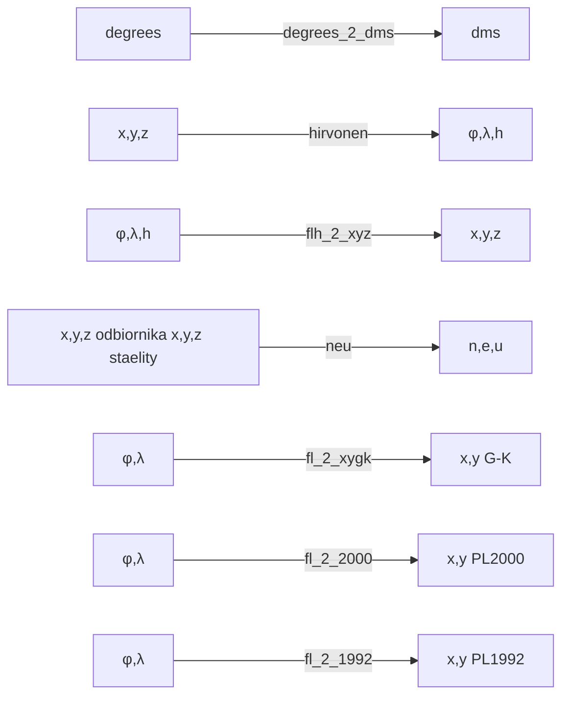

# ProjektTransformacje
## Opis
Projekt ten został stworzony do transformacji współrzędnych pomiędzy układami. Skrypt napisano w języku Python. 
Została w nim zaimplementowana klasa Transformations w której znajdują się poszczególne metody transformujące podane współrzędne do wskazanego przez użytkownika układu.
Program umożliwia konwertowanie współrzędnych z następujących elipsoid: **GRS80, WGS84, Krasowskiego**.

<span style="color:red">Ważne!</span>

**Wszystkie wartości kątowe wpisywane jako argumenty funkcji muszą byc podane w stopniach dziesiętnych (z częścią ułamkową po kropce)**

## Metody

## Opis funcji oraz ich wywołania z użyciem argparse

### <span style="color:green">**degrees_2_dms**</span>

Funkcja zamienia wartość w stopniach na wartość w stopniach, minutach i sekundach i zwraca ją jako string w postaci: deg°min'sec". Dodatkowo umożliwia wybór kolumny w pliku, której wartości mają zostac przeliczone.

| Funkcja 	| degrees_2_dms 	|
|---	|---	|
|flaga dla wywołania z pliku| -ff degrees_2_dms -cd 
|flaga dla wywołania w cmd| -dd
| liczba <br>argumentów 	| 1 	|
| argumenty 	| degrees 	|
| wywołanie z pliku 	| \<elipsoida\> -o \<plik z danymi\> -ff degrees_2_dms -cd \<numer kolumny\> <br><br>flaga -cd jest opcjonalna, gdy nie zostanie dodana funkcja<br> zamieni wszystkie wartości w pliku 	|
| wywołanie w cmd 	| \<elipsoida\> -dd  \<kąt w stopniach\> 	|


**Przykładowe wywołanie z pliku:**
```bash
python transformacje.py grs80 -o dane.txt -ff degrees_2_dms -cd 1
```
Program na podstawie danych z podanego pliku (dane.txt) przeliczy wartości w kolumnie pierwszej do postaci deg°min'sec". Następnie utworzy plik results.txt, w którym w każdym wierszu będą oddzielone
od siebie średnikiem wartości kątowe. Tylko kąty w kolumnie pierwszej będą w postaci deg°min'sec", reszta wartości będzie w stopniach dziesiętnych z częścią dziesiętną po kropce. Rodzaj elipsoidy nie ma w tym przypadku znaczenia (można wpisac 'wgs84', 'krasowski' lub 'grs80' i wynik działania funkcji będzie taki sam).

**Wygląd pliku z danymi**
```bash
52.45678987654;13.457898765;324.987;
45.978987567;12.078987789;302.78783;
59.87678326;10.0987877;290.87654342;
43.90;21.9878765;288.98765;
```
Plik wynikowy, powstający w wyniku wywołania funkcji:

```bash
52°27'24.44356";13.457898765;324.987;
45°58'44.35524";12.078987789;302.78783;
59°52'36.41974";10.0987877;290.87654342;
43°53'60.00000";21.9878765;288.98765;
```
**Przykładowe wywołanie w cmd**
```bash
python transformacje.py grs80 -dd 50.4565676
```

Program zamieni podaną wartośc i zwróci w konsoli w postaci:
```bash
50°27'23.64336"
```

### <span style="color:green">**hirvonen**</span>

Przelicza współrzędne prostokątne x, y, z geocentryczne do geodezyjnych φ, λ, h. Transformacja zwraca wynik w stopniach dziesiętnych postaci: (φ, λ, h) w układzie geodezyjnym.
| Funkcja 	| hirvonen 	|
|---	|---	|
|flaga dla wywołania z pliku| -ff hirvonen
|flaga dla wywołania w cmd| -hv
| liczba <br>argumentów 	| 3 	|
| argumenty 	| x,y,z 	|
| wywołanie z pliku 	| \<elipsoida\> -o \<plik z danymi\> -ff hirvonen  	|
| wywołanie w cmd 	| \<elipsoida\> -hv  \<x\> \<y\> \<z\> 	|

**Przykładowe wywołanie z pliku:**
```bash
python transformacje.py grs80 -o dane.txt -ff hirvonen
```
Program na podstawie danych z podanego pliku (dane.txt) współrzędnych
x, y, z utworzy plik results.txt, w którym w każdym wierszu będą oddzielone od siebie średnikiem współrzędne φ, λ, h w układzie geodezyjnym. Współrzędne te są podane w stopniach dziesiętnych. By przeliczyc φ i λ do postaci deg°min'sec" można skorzystac z funkcji degrees_2_dms.

**Wygląd pliku z danymi**
```bash
3598825.6091515315;1396795.7995926938;5060311.1639050525;
3517957.530599164;1452533.7324125404;5101057.867159183;
3435914.1862162645;1492730.3237949759;5144902.4283722425;

```
Plik wynikowy, powstający w wyniku wywołania funkcji:

```bash
52.84629999999978;21.212500000000002;100.00000778771937;
53.45669999999974;22.4353;110.00000899005681;
54.12339999999969;23.482499999999998;120.00001032464206;
```
**Przykładowe wywołanie w cmd**
```bash
python transformacje.py grs80 -hv 3655270.000 1030180.000 5107530.000
```
Program zwróci φ, λ, h w układzie geodezyjnym w konsoli postaci:
```bash
(53.55170961404108, 15.73965028282246, 337.3694756710902)
```
Wartości kątowe są podane w stopniach dziesiętnych

### <span style="color:green">**flh_2_xyz**</span>

Funkcja zamienia współrzędne geodezyjne φ, λ, h na współrzędne prostokątne X,Y,Z. Jest to transformacja odwrotna do Hirvonena. Wynik w postaci: (X,Y,Z) w układzie geocentrycznym.

| Funkcja 	| flh_2_xyz 	|
|---	|---	|
|flaga dla wywołania z pliku| -ff flh_2_xyz 
|flaga dla wywołania w cmd| -fx
| liczba <br>argumentów 	| 3 	|
| argumenty 	| φ, λ, h 	|
| wywołanie z pliku 	| \<elipsoida\> -o \<plik z danymi\> -ff flh_2_xyz  	|
| wywołanie w cmd 	| \<elipsoida\> -fx  \<phi\> \<lam\> \<h\> 	|

**Przykładowe wywołanie:**
```bash
python transformacje.py grs80 -o dane.txt -ff flh_2_xyz

```
Program na podstawie danych z podanego pliku (dane.txt) współrzędnych
φ, λ, h utworzy plik results.txt, w którym w każdym wierszu będą oddzielone od siebie średnikiem współrzędne x, y, z w układzie geocentrycznym.

**Wygląd pliku z danymi**
```
52.8463;21.2125;100.00
53.4567;22.4353;110.00
54.1234;23.4825;120.00
```
Plik wynikowy, powstający w wyniku wywołania funkcji:
```
3598825.6091515315;1396795.7995926938;5060311.1639050525;
3517957.530599164;1452533.7324125404;5101057.867159183;
3435914.1862162645;1492730.3237949759;5144902.4283722425;
```
**Wywołanie w cmd**
```
python transformacje.py grs80 -fx 53.55170961404108 15.73965028282246 337.369476
```
Program zwróci x, y, z w układzie geocentrycznym w konsoli w postaci:
```bash
(3655270.0000161408, 1030180.000004549, 5107530.000022553)

```
### <span style="color:green">**neu**</span>

Transformuje współrzędne geocentryczne odbiornika do współrzędnych topocentrycznych n, e, u na podstawie współrzędnych x, y, z odbiornika i satelitów. Zwraca wynik w postaci: (n,e,u) w układzie współrzędnych topocentrycznych.

| Funkcja 	| neu 	|
|---	|---	|
|flaga dla wywołania z pliku| -ff neu 
|flaga dla wywołania w cmd| -n
| liczba <br>argumentów 	| 6 	|
| argumenty 	| x_odb, y_odb, z_odb, x_sat, y_sat, z_sat 	|
| wywołanie z pliku 	| \<elipsoida\> -o \<plik z danymi\> -ff neu  	|
| wywołanie w cmd 	| \<elipsoida\> -n  \<x_odb\> \<y_odb\> \<z_odb\> \<x_sat\> \<y_sat\> \<z_sat\> 	|

**Przykładowe wywołanie:**
```bash
python transformacje.py grs80 -o dane.txt -ff neu
```
Program na podstawie danych z podanego pliku (dane.txt) współrzędnych
x_odb, y_odb, z_odb, x_sat, y_sat, z_sat utworzy plik results.txt, w którym w każdym wierszu będą oddzielone od siebie średnikiem współrzędne n, e, u w układzie współrzędnych topocentrycznych.

**Wygląd pliku z danymi**
```
3685825.7022625906;1378073.761327304;5002882.146444101;9785596.195556305;14216408.132039897;20399414.041585404;
3753448.3423;1455180.9409;4930981.7492;11504554.17988017;-20794755.888440542;11397606.776328057;
```
Plik wynikowy, powstający w wyniku wywołania funkcji:
```
1433804.6566615142;9889126.110578151;18418268.45441226;
4706744.939197872;-23547265.85921985;4508812.758259953;
```
**Wywołanie w cmd**
```bash
python transformacje.py grs80 -n 3685825.7022625906 1378073.761327304 5002882.146444101 9785596.195556305 14216408.132039897 20399414.041585404 
```
Program zwróci n, e, u w układzie współrzędnych topocentrycznych w konsoli w postaci:
```bash
(1433804.6566615142, 9889126.110578151, 18418268.45441226)
```
### <span style="color:green">**fl_2_xygk**</span>

Funkcja przelicza współrzędne geodezyjne φ, λ na współrzędne geocentryczne w układzie Gaussa-Krügera. Przy wyborze elipsoidy Krasowskiego należy podać h_krasowskiego. Południk osiowy l0 należy podać w stopniach, wybierając spośród 15, 18, 19, 21, 24. Wynik w postaci: (X_gk,Y_gk) w układzie Gaussa-Krügera.

| Funkcja 	| fl_2_xygk 	|
|---	|---	|
|flaga dla wywołania z pliku| -ff fl_2_xygk
|flaga dla wywołania w cmd| -gk
| liczba <br>argumentów 	| 3<br>dla elipsoidy Krasowskiego:<br>4 	|
| argumenty 	| φ, λ, l0<br><br>dla elipsoidy Krasowskiego:<br><br>φ, λ, l0, h 	|
| wywołanie z pliku 	| \<elipsoida\> -o \<plik z danymi\> -ff fl_2_xygk  	|
| wywołanie w cmd 	| \<elipsoida\> -gk  \<phi\> \<lam\> \<l0\><br><br>dla elipsoidy Krasowskiego:<br><br>krasowski -gk  \<phi\> \<lam\> \<l0\> \<h\>  	|

**Przykładowe wywołanie:**
```bash
python transformacje.py grs80 -o dane.txt -ff fl_2_xygk
```
Program na podstawie danych z podanego pliku (dane.txt) współrzędnych
φ, λ, l0 lub dla elipsoidy Krasowskiego: φ, λ, l0, h utworzy plik results.txt, w którym w każdym wierszu będą oddzielone od siebie średnikiem współrzędne x_gk, y_gk w układzie Gaussa-Krügera.

**Wygląd pliku z danymi**
```bash
50.098767;21.9876545678;19;
52.876347;22.5675674;21;
51.987678;20.6768727;24;
```
Plik wynikowy powstający w wyniku wywołania funkcji:
```bash
5556109.873216442;213745.917395645;
5862010.901366634;105538.9911732474;
5767190.39079345;-228257.59242107053;
```
**Wywołanie w cmd**
```bash
python transformacje.py krasowski -gk 50.000373107222224 16.001741142222222 15 259.5263
```
Program zwróci x_gk, y_gk w układzie Gaussa-Krügera w konsoli w postaci:
```bash
(5541326.34611664, 71695.12555565967)
```

### <span style="color:green">**fl_2_2000**</span>

Funkcja przelicza współrzędne geodezyjne φ, λ na współrzędne geocentryczne w układzie PL-2000. Przy wyborze elipsoidy Krasowskiego należy podać h_krasowskiego. Południk osiowy l0 należy podać w stopniach, wybierając spośród 15, 18, 21, 24. Wynik w postaci: (X_2000,Y_2000) w układzie PL-2000.

| Funkcja 	| fl_2_2000 	|
|---	|---	|
|flaga dla wywołania z pliku| -ff fl_2_2000 
|flaga dla wywołania w cmd| -20
| liczba <br>argumentów 	| 3<br>dla elipsoidy Krasowskiego:<br>4 	|
| argumenty 	| φ, λ, l0<br><br>dla elipsoidy Krasowskiego:<br><br>φ, λ, l0, h 	|
| wywołanie z pliku 	| \<elipsoida\> -o \<plik z danymi\> -ff fl_2_2000  	|
| wywołanie w cmd 	| \<elipsoida\> -20  \<phi\> \<lam\> \<l0\><br><br>dla elipsoidy Krasowskiego:<br><br>krasowski -20  \<phi\> \<lam\> \<l0\> \<h\>  	|

**Przykładowe wywołanie:**
```bash
python transformacje.py grs80 -o dane.txt -ff fl_2_2000
```
Program na podstawie danych z podanego pliku (dane.txt) współrzędnych
phi;lam;l0 lub dla elipsoidy Krasowskiego: φ, λ, l0, h utworzy plik results.txt, w którym w każdym wierszu będą oddzielone od siebie średnikiem współrzędne X_2000, Y_2000 w układzie PL-2000.

**Wygląd pliku z danymi**
```bash
50.098767;21.9876545678;21;
52.876347;22.5675674;24;
51.987678;20.6768727;21;
```
Plik wynikowy powstający w wyniku wywołania funkcji:
```bash
5551872.627690126;7570659.409210947;
5861369.592036961;8403566.064555522;
5761578.156298461;7477803.903134914;
```
**Wywołanie w cmd**
```bash
python transformacje.py krasowski -20 50.000373107222224 16.001741142222222 15 259.5263
```
Program zwróci x_2000, y_2000 w układzie PL-2000 w konsoli w postaci:
```bash
(5540899.663987989, 5571689.605030992)
```
### <span style="color:green">**fl_2_1992**</span>

Funkcja przelicza współrzędne geodezyjne φ, λ
na współrzędne geocentryczne w układzie PL-1992. Południk osiowy l0 jest równy 19.
Przy wyborze elipsoidy Krasowskiego należy podać h_krasowskiego.
Wynik w postaci: (X_1992, Y_1992) w układzie PL-1992

| Funkcja 	| fl_2_1992 	|
|---	|---	|
|flaga dla wywołania z pliku| -ff fl_2_1992 
|flaga dla wywołania w cmd| -92
| liczba <br>argumentów 	| 3<br>dla elipsoidy Krasowskiego:<br>4 	|
| argumenty 	| φ, λ, l0<br><br>dla elipsoidy Krasowskiego:<br><br>φ, λ, l0, h 	|
| wywołanie z pliku 	| \<elipsoida\> -o \<plik z danymi\> -ff fl_2_1992  	|
| wywołanie w cmd 	| \<elipsoida\> -92  \<phi\> \<lam\> \<l0\><br><br>dla elipsoidy Krasowskiego:<br><br>krasowski -92  \<phi\> \<lam\> \<l0\> \<h\>  	|

**Przykładowe wywołanie:**
```bash
python transformacje.py grs80 -o dane.txt -ff fl_2_1992
```
Program na podstawie danych z podanego pliku (dane.txt) współrzędnych
φ, λ, l0 lub dla elipsoidy Krasowskiego: φ, λ, l0, h utworzy plik results.txt, w którym w każdym wierszu będą oddzielone od siebie średnikiem współrzędne X_1992, Y_1992 w układzie PL-1992.

**Wygląd pliku z danymi**
```bash
50.098767;21.9876545678;19;
52.876347;22.5675674;19;
51.987678;20.6768727;19;
```
Plik powstający w wyniku wywołania funkcji:
```bash
252220.5963051906;713596.295253468;
562717.7352797342;739990.1096940814;
459266.46610497124;615111.315068834;
```
**Wywołanie w cmd**
```bash
python transformacje.py grs80 -92 53.55170961388889 15.739650283333333 19
```
Program zwróci x_1992, y_1992 w układzie PL-1992 w konsoli w postaci:
```bash
(636809.3247729586, 284095.1148406571)
```

## Formatowanie pliku z danymi 

<span style="color:red">Ważne!</span>

**W kolejnych linijkach w pliku wejściowym należy wpisać współrzędne oddzielone średnikami (CSV oddzielony średnikami).**

Przykładowy wygląd pliku z danymi oraz pliku powstającego w wyniku transformacji jest pokazany w każdym rozdziale dotyczątycym danej funkcji.

## Wymagania

Program można uruchomic na systemie Windows, MacOS lub Linux z zainstalowanym interpreterem python w wersji >=3.6.
Wymagane biblioteki:
- numpy 1.24.1
