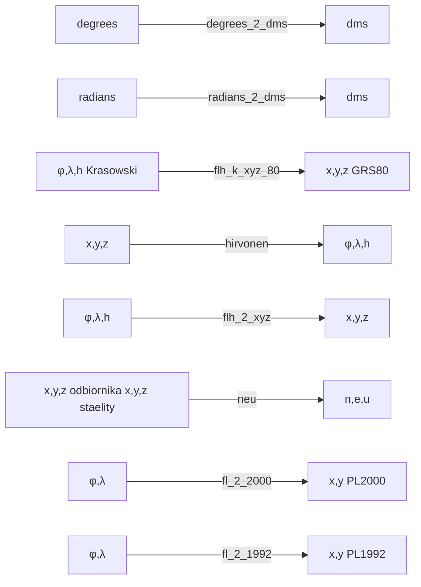

# ProjektTransformacje
## Opis
Projekt ten został stworzony do transformacji współrzędnych pomiędzy układami. 
Została w nim zaimplementowana klasa Transformations w której znajdują się poszczególne metody transformujące podane współrzędne do wskazanego przez użytkownika układu.
Program umożliwia konwertowanie współrzędnych z następujących elipsoid: **GRS80, WGS84, Krasowskiego**.

<span style="color:red">Ważne!</span>

**Wszystkie wartości kątowe wpisywane jako argumenty funkcji muszą by podane w stopniach dziesiętnych (z częścią ułamkową po kropce)**

# Metody

# Opis funcji oraz ich wywołania z użyciem argparse

- <span style="color:green">**degrees_2_dms**</span>

Funkcja zamienia wartość w stopniach na wartość w stopniach, minutach i sekundach i zwraca ją jako str: deg°min'sec"

| Funkcja 	| degrees_2_dms 	|
|---	|---	|
| liczba <br>argumentów 	| 1 	|
| argumenty 	| degrees 	|
| wywołanie z pliku 	| \<elipsoida\> -o \<plik\> -ff degrees_2_dms -cd \<numer kolumny\> <br><br>flaga -cd jest opcjonalna, gdy nie zostanie dodana funkcja<br> zamieni wszystkie wartości w pliku 	|
| wywołanie w cmd 	| \<elipsoida\> -dd  \<kąt w stopniach\> 	|


<br>

**Przykładowe wywołanie:**
```bash
python transformacje.py GRS80 -o dane.txt -ff degrees_2_dms
```
Program na podstawie danych z podanego pliku (dane.txt)
utworzy plik results.txt, w którym w każdym wierszu będą oddzielone
od siebie średnikiem kąty w postaci deg°min'sec" (tak jak w pliku wejściowym)

```bash
python transformacje.py GRS80 -dd 50.4565676
```
Program zamieni podaną wartośc i zwróci w konsoli w postaci:
```bash
50°27'23.64336"
```
- <span style="color:green">**radians_2_dms**</span>

Funkcja zamienia wartość w radianach na wartość w stopniach, minutach i sekundach i zwraca ją jako str: deg°min'sec"

| Funkcja 	| radians_2_dms 	|
|---	|---	|
| liczba <br>argumentów 	| 1 	|
| argumenty 	| radians 	|
| wywołanie z pliku 	| \<elipsoida\> -o \<plik\> -ff radians_2_dms -cd \<numer kolumny\> <br><br>flaga -cd jest opcjonalna, gdy nie zostanie dodana funkcja<br> zamieni wszystkie wartości w pliku 	|
| wywołanie w cmd 	| \<elipsoida\> -rd  \<kąt w radianach\> 	|

<br>

**Przykładowe wywołanie:**
```bash
python transformacje.py GRS80 -o dane.txt -ff radians_2_dms -cd 2
```
W tym wypadku program zamieni tylko dane znajdujące się w drugiej kolumnie
w pliku wejściowym

```bash
python transformacje.py GRS80 -rd 0.4565676

```
Program zamieni podaną wartośc i zwróci w konsoli w postaci:
```bash
26°9'33.82755"
```

- <span style="color:green">**flh_k_xyz_80**</span>

Funkcja przelicza współrzędne xyz z elipsoidy Krasowskiego na xyz w układzie GRS80. By wykonać transformacje należy przy inicjalizacji klasy wskazać nazwę elipsoidy jako Krasowski. Zwraca wynik w postaci (x_grs80, y_grs80, z_grs80)

| Funkcja 	| flh_k_xyz_80 	|
|---	|---	|
| liczba <br>argumentów 	| 3 	|
| argumenty 	| phi, lam, h 	|
| wywołanie z pliku 	| Krasowski -o \<plik\> -ff flh_k_xyz_80 	|
| wywołanie w cmd 	| Krasowski -kg  \<phi\> \<lam\> \<h\> 	|

**Przykładowe wywołanie:**
```bash
python transformacje.py Krasowski -o dane.txt -ff flh_k_xyz_80
```
Program na podstawie danych z podanego pliku (dane.txt) współrzędnych
x; y; z w układzie elipsoidy Krasowskiego utworzy plik results.txt, w którym w każdym wierszu będą oddzielone od siebie średnikiem współrzędne x ; y; z dla elipsoidy GRS80

```bash
python transformacje.py Krasowski -kg 50.000373107222224 16.001741142222222 259.5263
```
Program zwróci w konsoli x y z w układzie GRS80 w postaci:
```bash
(3948917.7691664626, 1132333.9490507406, 4863018.850918118)
```
- <span style="color:green">**hirvonen**</span>

Przelicza współrzędne prostokątne x,y,z do geodezyjnych φ, λ, h. Transformacja zwraca wynik w radianach postaci: (φ, λ, h)
| Funkcja 	| hirvonen 	|
|---	|---	|
| liczba <br>argumentów 	| 3 	|
| argumenty 	| x,y,z 	|
| wywołanie z pliku 	| \<elipsoida\> -o \<plik\> -ff hirvonen  	|
| wywołanie w cmd 	| \<elipsoida\> -hv  \<x\> \<y\> \<z\> 	|

**Przykładowe wywołanie:**
```bash
python transformacje.py GRS80 -o dane.txt -ff hirvonen
```
Program na podstawie danych z podanego pliku (dane.txt) współrzędnych
x; y; z utworzy plik results.txt, w którym w każdym wierszu będą oddzielone od siebie średnikiem współrzędne phi ; lam; h 

```bash
python transformacje.py GRS80 -hv 3655270.000 1030180.000 5107530.000
```
Program zwróci phi, lam, h w konsoli. Wartości kątowe są w radianach:
```bash
(0.9346536528369187, 0.2747087205477086, 337.3694756710902)
```

- <span style="color:green">**flh_2_xyz**</span>

Funkcja zamienia współrzędne geodezyjne φ, λ, h na współrzędne prostokątne X,Y,Z. Jest to transformacja odwrotna do Hirvonena. Wynik w postaci: (X,Y,Z)

| Funkcja 	| flh_2_xyz 	|
|---	|---	|
| liczba <br>argumentów 	| 3 	|
| argumenty 	| phi, lam, h 	|
| wywołanie z pliku 	| \<elipsoida\> -o \<plik\> -ff flh_2_xyz  	|
| wywołanie w cmd 	| \<elipsoida\> -fx  \<phi\> \<lam\> \<h\> 	|

**Przykładowe wywołanie:**
```bash
python transformacje.py GRS80 -o dane.txt -ff flh_2_xyz
```
Program na podstawie danych z podanego pliku (dane.txt) współrzędnych
phi; lam; h utworzy plik results.txt, w którym w każdym wierszu będą oddzielone od siebie średnikiem współrzędne x; y; z

```bash
python transformacje.py GRS80 -fx 53.55170961404108 15.73965028282246 337.369476
```
Program zwróci x,y,z w konsoli w postaci:
```bash
(3655270.0000161408, 1030180.000004549, 5107530.000022553)
```
- <span style="color:green">**neu**</span>

Transformuje współrzędne geocentryczne odbiornika do współrzędnych topocentrycznych n, e, u na podstawie współrzędnych x,y,z odbiornika i satelitów. Zwraca wynik w postaci: (n,e,u)

| Funkcja 	| neu 	|
|---	|---	|
| liczba <br>argumentów 	| 6 	|
| argumenty 	| x_odb, y_odb, z_odb, x_sat, y_sat, z_sat 	|
| wywołanie z pliku 	| \<elipsoida\> -o \<plik\> -ff neu  	|
| wywołanie w cmd 	| \<elipsoida\> -n  \<x_odb\> \<y_odb\> \<z_odb\> \<x_sat\> \<y_sat\> \<z_sat\> 	|

**Przykładowe wywołanie:**
```bash
python transformacje.py GRS80 -o dane.txt -ff neu
```
Program na podstawie danych z podanego pliku (dane.txt) współrzędnych
x_odb, y_odb, z_odb, x_sat, y_sat, z_sat utworzy plik results.txt, w którym w każdym wierszu będą oddzielone od siebie średnikiem współrzędne n; e; u

```bash
python transformacje.py GRS80 -n 
```
Program zwróci n,e,u w konsoli w postaci:
```bash
()
```
- <span style="color:green">**fl_2_2000**</span>

Funkcja przelicza współrzędne geodezyjne φ, λ na współrzędne geocentryczne w układzie PL-2000. Przy wyborze elipsoidy Krasowskiego należy podać h_krasowskiego. Południk osiowy l0 należy podać w stopniach. ynik w postaci: (X_2000,Y_2000)

| Funkcja 	| fl_2_2000 	|
|---	|---	|
| liczba <br>argumentów 	| 3<br>dla elipsoidy Krasowskiego:<br>4 	|
| argumenty 	| phi, lam, l0<br><br>dla elipsoidy Krasowskiego:<br><br>phi, lam, l0, h 	|
| wywołanie z pliku 	| \<elipsoida\> -o \<plik\> -ff fl_2_2000  	|
| wywołanie w cmd 	| \<elipsoida\> -20  \<phi\> \<lam\> \<l0\><br><br>dla elipsoidy Krasowskiego:<br><br>Krasowski -20  \<phi\> \<lam\> \<l0\> \<h\>  	|

**Przykładowe wywołanie:**
```bash
python transformacje.py GRS80 -o dane.txt -ff fl_2_2000
```
Program na podstawie danych z podanego pliku (dane.txt) współrzędnych
phi;lam;l0 lub dla elipsoidy Krasowskiego: phi;lam;l0;h utworzy plik results.txt, w którym w każdym wierszu będą oddzielone od siebie średnikiem współrzędne x20;y20

```bash
python transformacje.py Krasowski -20 50.000373107222224 16.001741142222222 15 259.5263
```
Program zwróci x20, y20 w konsoli w postaci:
```bash
(5540899.663987989, 5571689.605030992)
```
- <span style="color:green">**fl_2_1992**</span>

Funkcja przelicza współrzędne geodezyjne φ, λ
na współrzędne geocentryczne w układzie PL-1992.
Przy wyborze elipsoidy Krasowskiego należy podać h_krasowskiego.
Wynik w postaci: (X_1992,Y_1992)

| Funkcja 	| fl_2_1992 	|
|---	|---	|
| liczba <br>argumentów 	| 3<br>dla elipsoidy Krasowskiego:<br>4 	|
| argumenty 	| phi, lam, l0<br><br>dla elipsoidy Krasowskiego:<br><br>phi, lam, l0, h 	|
| wywołanie z pliku 	| \<elipsoida\> -o \<plik\> -ff fl_2_1992  	|
| wywołanie w cmd 	| \<elipsoida\> -92  \<phi\> \<lam\> \<l0\><br><br>dla elipsoidy Krasowskiego:<br><br>Krasowski -92  \<phi\> \<lam\> \<l0\> \<h\>  	|

**Przykładowe wywołanie:**
```bash
python transformacje.py GRS80 -o dane.txt -ff fl_2_1992
```
Program na podstawie danych z podanego pliku (dane.txt) współrzędnych
phi;lam;l0 lub dla elipsoidy Krasowskiego: phi;lam;l0;h utworzy plik results.txt, w którym w każdym wierszu będą oddzielone od siebie średnikiem współrzędne x92;y92

```bash
python transformacje.py GRS80 -92 53.55170961388889 15.739650283333333 19
```
Program zwróci x92, y92 w konsoli w postaci:
```bash
(636809.3247729586, 284095.1148406571)
```

# Wygląd pliku z danymi 

<span style="color:red">Ważne!</span>

**W kolejnych linijkach w pliku wejściowym należy wpisać współrzędne oddzielone średnikami.**

- Przykładowy wygląd pliku dla przeliczenia φ,λ,h do x,y,z dla elipsoidy GRS80. Dane w każdej linijce pliku muszą byc wpisane w postaci: φ;λ;h

```bash
52.45678987654; 13.457898765; 324.987;
45.978987567; 12.078987789; 302.78783;
59.87678326; 10.0987877; 290.87654342;
43.90; 21.9878765; 288.98765;
```
Plik results.txt, który powstaje w wyniku przeliczenia powyższych wartości na x,y,z: 

```bash
3788029.81191433;906482.1186637862;5034193.738700127;
4341904.223809285;929158.2440457781;4563842.549821416;
3159412.309512206;562708.0780869896;5493852.084013798;
4268559.280520176;1723559.3431196345;4400292.58979039;
```
- Przykładowy wygląd pliku dla przeliczenia wartości w stopniach na wartości w stopniach, minutach i sekundach

```bash
52.45678987654; 13.457898765; 324.987;
45.978987567; 12.078987789; 302.78783;
59.87678326; 10.0987877; 290.87654342;
43.90; 21.9878765; 288.98765;
```
Poniższe przeliczenie będzie wykonane tylko dla kolumny pierwszej.

```bash
52°27'24.44356";13.457898765;324.987;
45°58'44.35524";12.078987789;302.78783;
59°52'36.41974";10.0987877;290.87654342;
43°53'60.00000";21.9878765;288.98765;
```

# Wymagania

Program można uruchomic na komputerze z systemem Windows, MacOs i Linux. Do działania potrzebuje on zainstalowanego Pythona w wersji co najmniej 3.7 oraz poniższe biblioteki:

- NumPy
- argparse


