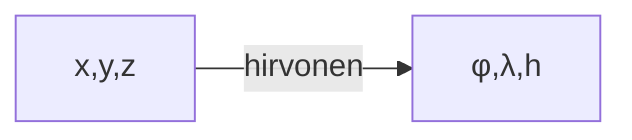
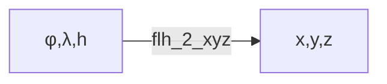
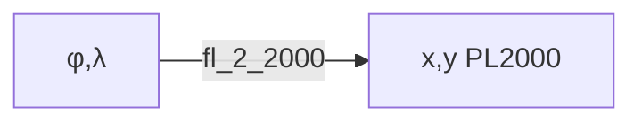
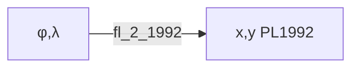
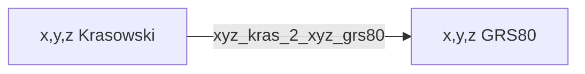
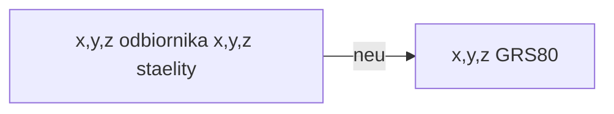

# ProjektTransformacje
## Do czego służy
Projekt ten został stworzony do transforamcji współrzędnych pomiędzy układami. 
Została w nim zaimplementowana klasa Transformations w której znajdują się poszczególne metody transformujące podane współrzędne do wskazanego przez użytkownika układu.
# Metody






# Wywołanie
Program umożliwia konwertowanie współrzędnych z następujących elipsoidach: **GRS80, WGS84, Krasowskiego**.

Program umożliwia konwertowanie dużej ilości współrzędncyh z pliku, ale także pojedynczych wpisywanych "z palca"

Podstawowe wywołanie dla współrzędncyh z pliku :
```bash
python transformacje.py {nazwa elipsoidy} {plik z danymi} {funkcja}
```
**Przykład:**
```bash
python transforamcje.py GRS80 dane.txt hirvonen
```
Podstawowe wywołanie dla współrzędncyh "z palca" :
```bash
python transformacje.py {nazwa elipsoidy} {flaga funkcji} {współrzędne oddzielone spacjami} 
```

**Przykład:**
```bash
python transforamcje.py GRS80 --flh_2_xyz 51 21 100
```


<span style="color:red">Ważne!</span>


współrzędne w metodzie "z palca" muszą być zapisane w stopniach dziesiętnych (z częścią dziesiętną po przecinku)

# Wygląd pliku z danymi 

<span style="color:red">Ważne!</span>

W kolejnych linijkach w pliku wejściowym należy wpisać współrzędne oddzielone średnikami. 

Przykładowy wygląd pliku dla przeliczenia φ,λ,h do x,y,z. 


Dane w każdej linijce pliku muszą byc wpisane w postaci: φ;λ;h

# Wymagania

Program można uruchomic na komputerze z systemem Windows, MacOs i Linux. Do działania potrzebuje on zainstalowanego Pythona w wersji co najmniej 3.7 oraz poniższe biblioteki:

- NumPy
- argparse


